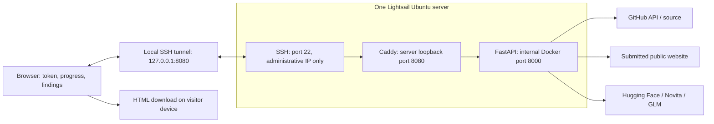

# GLM-5.3 local chat

Text chat through Hugging Face Inference Providers, with a local FastAPI webpage.
Step 1 connectivity was confirmed by the user's successful Novita response. Step 2
adds the chat interface and bounded conversation history. Step 3 adds HTTP GET
collection and analysis of response headers and HTML.

The AWS test deployment uses one Lightsail server and visitor-supplied HF tokens.
See [architecture and deployment steps](#aws-lightsail-test-deployment).
Without a domain, use the SSH tunnel setup below. The original terminal-token
local mode remains available.

## Analyze a webpage (Step 3)

Restart the server after updating dependencies with the commands below. In the
**Analyze a webpage** form, enter an HTTP(S) URL and your question, then click
**Fetch and analyze**. Python collects the response and sends it to GLM-5.3 through
Hugging Face. The result shows the final URL, HTTP status, number of responses,
body byte count, and model analysis. This analysis is separate from chat history;
submitting again fetches again. No evidence is saved to disk.

**Headers and HTML are sent without redaction, extraction, or summarization**, as
requested. This includes cookie values and any credentials or sensitive content
returned by the website. The app does not forward its Hugging Face token, browser
cookies, or user-supplied request headers to the target. The token is used only by
the inference client. The user question and untrusted evidence are separate
messages; the model receives no tools and cannot initiate additional requests.

Repeated response headers (including Set-Cookie) are preserved as ordered name/value
pairs. Each redirect response and its body are included. HTML whitespace, inline
scripts, and comments are retained. The payload uses JSON encoding, which preserves
these values after decoding. This is not a raw wire capture: the HTTP library parses
headers and removes transfer framing; body bytes are strictly decoded with the
declared charset, or UTF-8 when absent. Unsupported/invalid text encodings fail
instead of replacing characters. Compressed responses are rejected if a server
ignores `Accept-Encoding: identity`. No scripts run and no linked assets are fetched.

Only public DNS hostnames on standard HTTP/HTTPS ports are supported. IP-literal,
credential-bearing, private, loopback, metadata, and transition-IP destinations are
blocked. All A/AAAA answers are checked before connecting directly to one approved
IP. HTTPS certificates and SNI use the original hostname. Environment proxies and
automatic redirect following are not used. A request authorizes only the submitted
hostname; redirects to another hostname require submitting that URL separately.
This is a local single-user tool, not a persistent organizational target registry.

Limits: five redirects, 100000 bytes across response bodies and header names/values,
and 140000 characters of serialized evidence. Exceeding a limit fails before the
LLM call; there is no silent truncation or chunking. DNS queries have a three-second
lifetime per address family. Sockets have a ten-second inactivity timeout, with a
45-second collection budget checked between hops and body reads (an in-flight
operation can exceed that budget). Provider context limits may still reject a
payload; application size limits are not exact tokenizer limits.

The collection and LLM paths are tested with mocks; no automated tests contact
external websites. Live analysis requires your token and an authorized target.

## Start the chat webpage

From this repository in the VS Code PowerShell terminal:

```powershell
uv --cache-dir .uv-cache pip install --python .venv/Scripts/python.exe -r requirements.txt
.venv/Scripts/python.exe run_chat.py --prompt-token
```

Paste your token at `Hugging Face token (hidden):` and press Enter. No characters
appear while pasting. The token stays in server memory and is not saved or sent to
the browser. Open **http://127.0.0.1:8000** to chat. Press Ctrl+C in the terminal to
stop the server. If port 8000 is busy, add `--port 8001` and open the printed URL.
An existing `HF_TOKEN` environment variable also works without `--prompt-token`.

Type a message and click **Send message**, or press Enter. Shift+Enter inserts a
newline. **New chat** clears the conversation; refreshing the page also clears it.
History is kept in tab memory, with no browser local storage or server database.
Each request sends the current conversation to Hugging Face and the selected
provider; inference uses account credits. Clearing the UI does not delete provider
records. Answers are shown as plain text, including any code or Markdown.

The model is `zai-org/GLM-5.3`, with provider `novita` by default; `--provider NAME`
selects another supported route. Each request uses low reasoning effort, a
2048-token output budget, and a 90-second HTTP timeout. No application retries or
fallback models are used. The page reports errors and incomplete token-limited
answers. It permits 10 previous exchanges, 20000 characters per message and 40000
characters total; start a new chat when these limits are reached. Character bounds
are conservative application limits, not an exact tokenizer/context calculation.

`run_chat.py` is the original single-user, loopback-only mode with a terminal token.
For visitor tokens on localhost, run `.venv/Scripts/python.exe run_server.py --local`.
For the AWS container entry point, use the deployment instructions below. Host and
Origin checks, a single-operation limit, sanitized errors, and escaped output apply
in all modes. Only the Python collector fetches submitted targets; GLM has no tools.

## Offline tests

```powershell
.venv/Scripts/python.exe -m unittest -v
```

Tests mock inference and cover the original checker, chat history validation,
static assets, source checks, body size limits, provider errors and token redaction.
No real tokens or external inference calls are used by the tests.

## AWS Lightsail test deployment

One Ubuntu 24.04 Lightsail instance in `us-east-1`, using the public IPv4 2 GB / 2 vCPU
bundle (`small_3_0`, USD 12/month before taxes and excess usage). No NAT gateway,
load balancer, registration, database, queues, or report bucket. Visitors pay their
own Hugging Face inference charges. See [Lightsail pricing](https://aws.amazon.com/lightsail/pricing/).

The current test setup has **no domain**. Its web port binds only to server loopback
and is reached through an encrypted SSH tunnel. A separate optional configuration
supports public HTTPS when a domain is available.

### Architecture



- Docker Compose runs one `app` process and `caddy`; both restart automatically.
- The app accepts one operation at a time across GitHub scanning, HTTP inspection,
  and chat. Other requests receive HTTP 429 with a server-busy message.
- Visitors enter their own HF token in a masked field. Tokens travel in a request
  header, never in URLs or prompts. Each operation creates its own inference client.
- Tokens, conversation, source, findings and generated reports use memory only.
  There is no history, job ID, progress lookup, report storage or retrieval API.
  Browser refresh/close/Clear session discards results and tokens, including restored
  history pages. Downloaded HTML remains on the visitor's device.
- NDJSON events (`progress`, `snapshot`, `complete`, `error`, `heartbeat`) carry
  request-local progress and validated partial reports over the same response.
  Completed batches remain downloadable after cancellation or a later error.
- A bounded event queue connects the worker to the response stream. Heartbeats
  occur while idle; downloads and batch boundaries check cancellation and a
  two-hour deadline. An in-flight HTTP/provider call may finish or time out first;
  the busy slot remains held until its worker exits. Nothing resumes after restart.
- App filesystem is read-only, temporary filesystems are memory-backed, and Docker
  logs are disabled for both services. Host bootstrap disables swap and core dumps.
  Caddy also discards its logs, so request headers cannot enter proxy logs.
- Source limits, provider timeouts, source citation validation, HTML escaping, and
  blocking of private/cloud metadata destinations remain in place.

### Deployment without a domain (current mode)

1. Create the Ubuntu instance and attach a static IP. Use a distinct name for the
   instance and SSH key pair (Lightsail resource names share a namespace).
   Set its firewall to TCP 22 from your administrative public IP only. Leave
   TCP 80, 443, 8000 and 8080 closed publicly.
2. Supply `deploy/bootstrap.sh` as Lightsail user data, or copy it to the server
   and run `sudo sh deploy/bootstrap.sh`. It installs Git and Docker Engine/Compose
   using [Docker's Ubuntu repository](https://docs.docker.com/engine/install/ubuntu/).
   The script is POSIX-compatible because Lightsail wraps user data in `/bin/sh`.
3. Copy the implementation branch to the server (clone directly if the repository
   is publicly readable, or upload a Git archive from your authenticated checkout).
   Never copy `.env`, SSH/AWS credentials, `.venv` or local reports.
4. In the server's repository directory, run:

   ```bash
   sudo docker compose -f compose.yaml -f compose.tunnel.yaml config --quiet
   sudo docker compose -f compose.yaml -f compose.tunnel.yaml up -d --build
   sudo docker compose -f compose.yaml -f compose.tunnel.yaml ps
   curl --fail http://127.0.0.1:8080/healthz
   ```

   Compose 2.24.4+ is required for the port/volume overrides. No `.env` or shared
   `HF_TOKEN` is required. This mode creates no persistent application data volume.
5. On your computer, keep this tunnel command running, substituting the actual
   private-key path and static IP:

   ```powershell
   ssh -i "$env:USERPROFILE\.ssh\bonnyai-lightsail.pem" -N -L 127.0.0.1:8080:127.0.0.1:8080 -o ExitOnForwardFailure=yes -o ServerAliveInterval=30 ubuntu@LIGHTSAIL_STATIC_IP
   ```

6. Open **http://127.0.0.1:8080**, enter your HF token, and use the web interface.
   SSH encrypts the connection to AWS. The server cannot be opened directly by its
   public IP. If your public IP changes, update the Lightsail SSH firewall rule.

### Optional public HTTPS when a domain is available

Point a DNS A record to the static IP, open TCP 80/443, and keep SSH restricted.
Copy `.env.example` to `.env`, setting `APP_DOMAIN` to a lowercase DNS hostname
without a scheme, path or port. Do not add HF tokens to the file.

Switch configurations by stopping the tunnel stack first:

```bash
sudo docker compose -f compose.yaml -f compose.tunnel.yaml down
sudo docker compose config --quiet
sudo docker compose up -d --build
sudo docker compose ps
```

Caddy obtains/renews TLS certificates and persists them in `caddy_data`. Only Caddy
publishes 80/443; app port 8000 stays internal. Plain HTTP API submissions are
rejected; GET/HEAD requests redirect to HTTPS. Caddy requires working DNS and
reachable challenge ports; see [automatic HTTPS](https://caddyserver.com/docs/automatic-https).
The app fails startup without `APP_DOMAIN` in public mode. Run a single process;
multiple processes would each have a separate busy lock.

### Updates and checks

Wait for any active operation to finish, update the checkout/archive, and rerun the
same Compose build command for the selected mode. For a Git clone, first run
`git pull --ff-only origin feature/aws-test-deployment`. Container/server restart
interrupts scans; visitors must resubmit them.

Offline verification: `.venv/Scripts/python.exe -m unittest -q` and
`node test_browser.cjs`. Tests use simulated providers and repositories and cover
visitor token isolation, same-origin restrictions, streaming partial reports,
busy-slot release, deadlines, cancellation, rendering, download and page cleanup.
Live inference requires a visitor's funded HF token; offline tests do not establish
model detection accuracy. Check container health and `/healthz` after deployment.
For startup diagnosis, use `docker compose ps` and `docker inspect`; persistent
application/proxy logs are intentionally disabled.

## Setup (Python 3.12+)

Run from this repository in PowerShell:

```powershell
uv --cache-dir .uv-cache venv .venv
uv --cache-dir .uv-cache pip install --python .venv/Scripts/python.exe -r requirements.txt
.venv/Scripts/python.exe check_llm.py --prompt-token
```

Create a token in [Hugging Face settings](https://huggingface.co/settings/tokens)
with permission to call Inference Providers. Enter it at the hidden terminal prompt;
the script does not save it. Do not paste your token into chat or commit it to Git.
Alternatively, supply `HF_TOKEN` through your environment or secret manager.
The script does not load `.env` files or cached CLI credentials.

The request uses `zai-org/GLM-5.3` with `novita` through the Hugging Face SDK,
a 90-second HTTP timeout, low reasoning effort, and a 256-token output limit.
Inference can consume account credits. Provider availability and parameter support
can change; use `--provider NAME` to select another supported Hugging Face provider.
No fallback model or automatic application retries are configured.

A successful call prints the model, provider, answer, and finish reason. An empty
answer is not treated as success. Exit codes: 0 = answer received, 1 = inference
failure, 2 = missing credentials or invalid CLI usage. A token-limited response
does not imply the model completed its answer.

## Verification status

The user verified the connection checker with `Connection successful` and finish
reason `stop` through Novita. The new web chat is tested offline; its live inference
must be exercised with a visitor token in the browser (or a terminal token in local mode).

References: [GLM-5.3](https://huggingface.co/zai-org/GLM-5.3),
[Hugging Face chat completion](https://huggingface.co/docs/inference-providers/en/tasks/chat-completion).

## Review a GitHub repository

Use **Review GitHub source code** with any public repository URL such as
`https://github.com/owner/repository`. Optionally enter a branch, tag, or commit;
leaving it blank reviews the default branch. Click **Scan repository**. Collection
and batch progress appear on the page with collected, reviewed, and skipped counts.
Results appear directly below the form as readable finding cards: bold titles,
colored severity, description, root cause, evidence, proposed exploitation steps,
code fixes, and regression tests. Confirmed findings and findings needing verification
are separated. Expand the coverage lists to inspect skipped files or failures.
**Download HTML report** saves the same findings and coverage as a standalone report.
Restart the server and refresh the page after updating. No scan CLI is required;
WebGoat is only an optional evaluation example, not a scanner-specific target.

The collector requests only the commit SHA, lists that commit's files using the
[GitHub trees API](https://docs.github.com/en/rest/git/trees), and downloads selected
source files from raw.githubusercontent.com. It never downloads a repository ZIP,
so large assets do not count toward a whole-repository download limit.
GLM receives selected UTF-8 source-code files with paths and original contents.
Application endpoints, security code, lessons, and templates are prioritized, followed
by other application source; tests and tooling come last. Pipeline, Docker/container, build/deployment, configuration,
and documentation files are excluded before downloading. This includes CI directories
(such as `.github`, `.gitlab`, `.circleci`, and `pipelines`), Dockerfile variants,
container/deployment directories, known build scripts and `*.config.*` files.
JSON, YAML, XML, TOML, Terraform, Gradle, Markdown, and text files are excluded.
Application source, templates, tests, and ordinary shell scripts remain eligible.
Selection uses extensions and known path/name conventions; unusually named automation
scripts with a source-code extension may still be included.
GLM is asked for severity, confidence, file/line evidence, impact and prerequisites,
concrete proposed fixes (preferably diffs), and suggested regression tests.
Intentional training vulnerabilities (including WebGoat lessons) remain in scope and
are labeled explicitly. Each batch must return validated JSON findings with a title,
severity, confidence, description, root cause, source references, input-to-sink trace,
impact, prerequisites, proposed exploitation steps, code fix, and regression test.
References must cite supplied files and valid line ranges. Validation checks structure
and reference bounds; it cannot prove that a model's security conclusions are correct.
The styled HTML report is generated from those fields, with colored severity badges,
code blocks, and collapsible coverage inventories. Counts are calculated by Python.

This is a bounded static review: up to 400 source download attempts, 30000 bytes per
file, and 1200000 collected source bytes overall. Source is reviewed in up to 24
batches, each bounded to 80000 source bytes and 140000 serialized input characters.
Primary files occupy roughly three quarters of each batch, reserving space for
referenced helpers and security context. Files stay adjacent by directory where
possible; context uses lexical symbol matching, not a language-aware call graph.
Every primary file receives its own review even if used as context in another batch.
Batch progress is displayed in the page. Up to 24 provider requests can consume
credits per scan; larger scans can take many minutes. Files that do not
fit are listed as skipped, without truncating file contents. Dependency/build
folders, recognized lockfiles, minified files, symlinks, binary/non-UTF-8 files, and
unsupported extensions are skipped. File-list metadata over 10 MB, more than 100000 entries, or a truncated
GitHub file list fail explicitly before inference. The collection budget is
300 seconds checked between reads/requests, with existing DNS and socket timeouts;
an in-flight operation may exceed the budget. The review uses an 8192-token output
budget and the existing 90-second provider timeout per batch. Truncated or invalid
structured answers are recorded as failed batches, never clean scans; unvalidated
output is not rendered as findings. Provider errors stop subsequent requests and
preserve already validated findings. Duplicates with identical root causes and source
locations are collapsed. Files are counted as reviewed only after their primary batch
returns a complete validated response. Skipped files or failed batches make coverage
explicitly partial; no findings does not mean the repository is safe.

Only public repositories on github.com are supported; no GitHub credentials are
used. GitHub rate limits and unavailable refs produce a visible error. Downloads
use validated public IPs and HTTPS, and redirects are restricted to api.github.com
and raw.githubusercontent.com. No archives are extracted, code executed, dependencies
installed, or fixes applied. Submodules and Git LFS contents are not fetched.
Repository instructions are treated as untrusted input, and GLM has no tools.
Source contents, including any embedded secrets, are sent to Hugging Face and the
configured inference provider. The server does not persist source or reports;
the generated report stays in tab memory until cleared/refreshed/closed, and the download
saves it using your browser. Model output and filenames are HTML-escaped in the
report. Findings and patches require human review; no findings does not prove
that the repository is secure.

Repository tests use mocked file lists, source downloads, and inference responses. They
cover URL and redirect boundaries, size limits, file selection, unsafe repository
paths, commit pinning, prompt construction, escaped HTML reports, API validation,
and recovery after failures. Live repository review with GLM has not been verified.

Browser regression checks use simulated GitHub and model responses for Python,
JavaScript, and Java repository layouts. Run `node test_browser.cjs` with Node 22+
and Microsoft Edge installed (or set `BROWSER_PATH` to a Chromium executable).
These exercise the page, streamed progress, formatted findings, safe code display,
download action, partial/empty/error states, reset, and mobile layout without tokens
or external requests. They validate the interface, not live vulnerability detection.

### Evaluate detection with GLM

The opt-in evaluation uses eight synthetic source fixtures: vulnerable and mitigated
examples of SQLi, XSS, access control, and credentials. It checks the expected category
and false positives for each paired control. These are live model evaluations, separate
from the offline pipeline tests, and consume provider credits. The optional WebGoat
pass reviews the exact commit from the supplied report and exports a new HTML report;
inspect its findings and coverage manually. Source fixtures are never executed.

```powershell
.venv/Scripts/python.exe evaluate_review.py --prompt-token --webgoat
```

The evaluation saves `review-evaluation.json` and, with `--webgoat`,
`review-evaluation.webgoat.html` locally. These files contain findings and code fixes;
they are ignored by Git by default. No live accuracy score is claimed until this runs.
